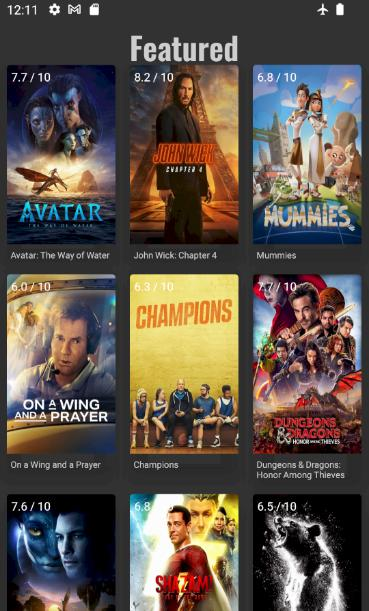
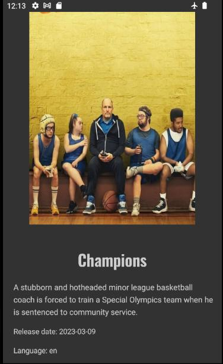

# MovieBrowse

## Description
An Android application in Kotlin for browsing a list of films, that are popular right now.



## UI Framework
Jetpack Compose

## Architecture
The project follows **Clean Architecture** principles with a **multi-module** structure.

### Module Structure
```
app/                          # Entry point, navigation, DI setup
feature/
├── movies/
│   ├── data/                 # Repository implementation, Ktor API, DTOs
│   ├── domain/               # Use cases, repository interfaces, models
│   └── presentation/         # ViewModels, Compose UI screens
└── settings/
    └── presentation/         # Settings screen, SettingsViewModel
core/
├── data/                     # Shared DataStore implementation
├── domain/                   # Shared use cases, storage interfaces
└── presentation/             # Shared UI components, fonts
```

### Layers
- **data** — network requests, local storage, mappers from DTO to domain models
- **domain** — business logic, use cases, repository interfaces. Pure Kotlin, no Android dependencies
- **presentation** — UI built with Jetpack Compose, ViewModels with Hilt injection

## Libraries
* **Ktor-client** - sending requests to API
* **Coil** - showing an image based on the model's URL
* **Navigation-Compose** - changing components based on the current route
* **Hilt** - dependency injection
* **DataStore** - persistent local storage for user preferences

#### Prerequisites
Get your api key from the [official website of an API](https://developer.themoviedb.org/docs/getting-started) and pass it into path inside **fetchMovies()** in **MovieViewModel.kt**