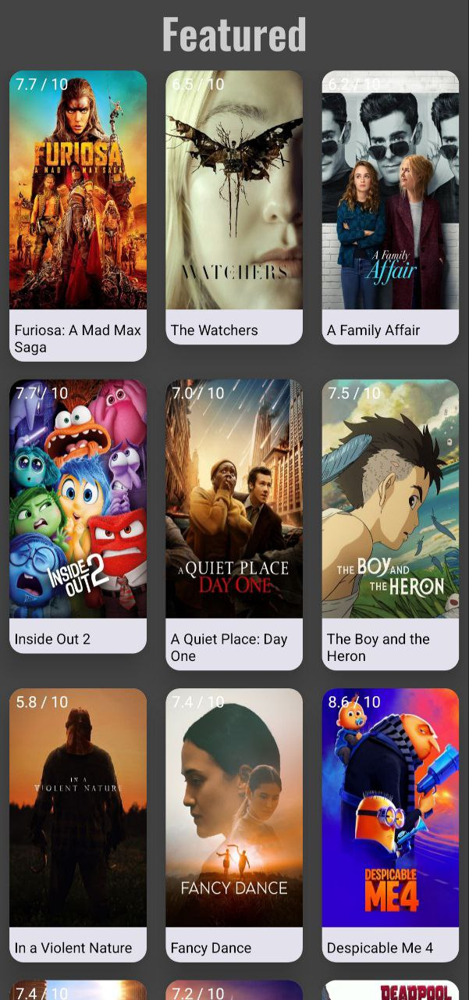

# MovieBrowse

## Description
An Android application in Kotlin for browsing a list of films, that are popular right now.

## UI Framework
Jetpack Compose

## Libraries
* **Ktor-client** - sending requests to API
* **Coil** - showing an image based on the model's URL
* **Navigation-Compose** - changing components based on the current route

#### Prerequisites
Get your api key from the [official website of an API](https://developer.themoviedb.org/docs/getting-started) and pass it into path inside **fetchMovies()** in **MovieViewModel.kt**
